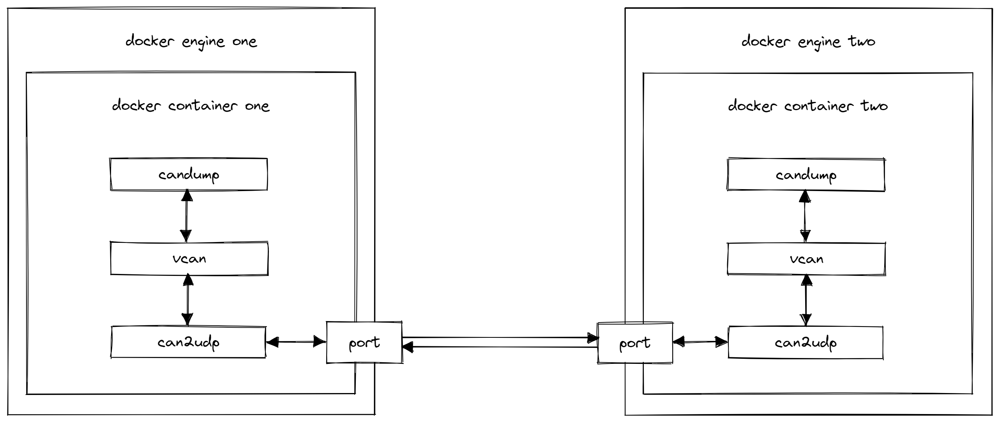

# Docker Virtual CAN

Simple demo that connects two applications running in different containers on different hosts via a virtual CAN.
In a nutshell, each container initializes a virtual CAN und starts a [can2udp](https://opensource.lely.com/canopen/docs/can2udp/0) process.
In our demo we start the containers on the same docker engine and use `candump` as dummy application inside the container.



We assume that
- ports 6001 and 6002 are available
- that docker engine is running under 172.17.0.1

Note, since we initialize the CAN inside the container the NET_ADMIN capability is required.

To start the services and to attach to the logs run the following command.
```
docker-compose up
```

You can send a message on one of the local CANs as follows.
```
docker-compose exec one cansend vcan0 01a#11223344AABBCCDD
```

Note, this example does NOT WORK on Windows using WSL backend since there is no support for SocketCAN, see https://github.com/microsoft/WSL/issues/5533.